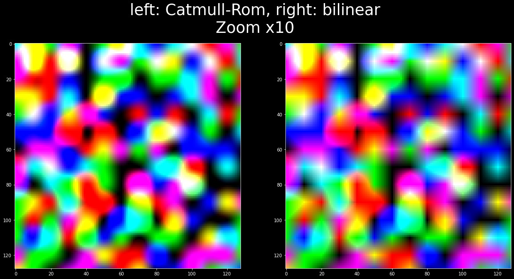

# Dense Image Warp with Catmull-Rom interpolation
Reimplementation of the dense image warp with catmull rom interpolation instead of bilinear. One use case can be motion vector reprojection, but really, catmull-rom has significantly nicer properties than bilinear.

# Usage
The file you're looking for is `dense_image_warp.py` and the function is `dense_image_warp_catmull( img, array_of_coordinates )`

Use it the same way you use the bilinear version. It is a drop-in replacement for the tensorflow function `tensorflow_addons.image.dense_image_warp`

example of motion reprojection:

```py
prev_rgb = dense_image_warp.dense_image_warp_catmull(prev_rgb, motion_vectors)
```

Please look into test.ipynb for an example of how to use it, and for the code generating an image similar to the one below.

## Result:
The Catmull-Rom interpolation has less artifacts, notably the elongated crosses created by the bilinear are now smoothly reconstructed with rounded edges. This behavior is much more desirable, especially when dealing with fourier reconstructions or neural networks.


